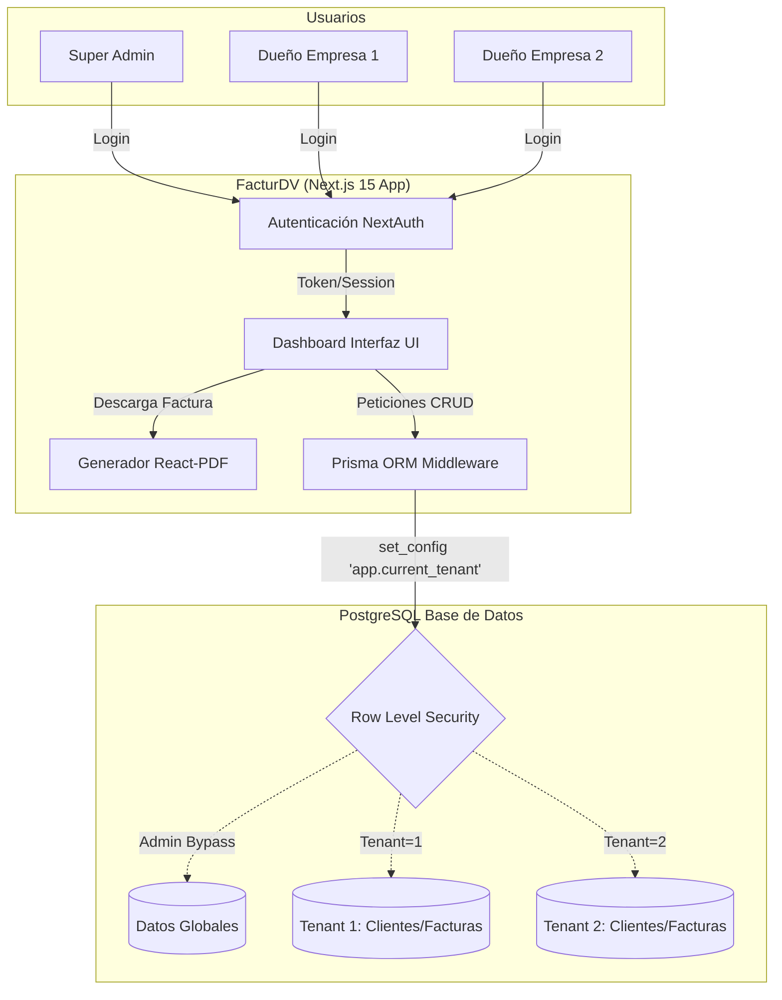
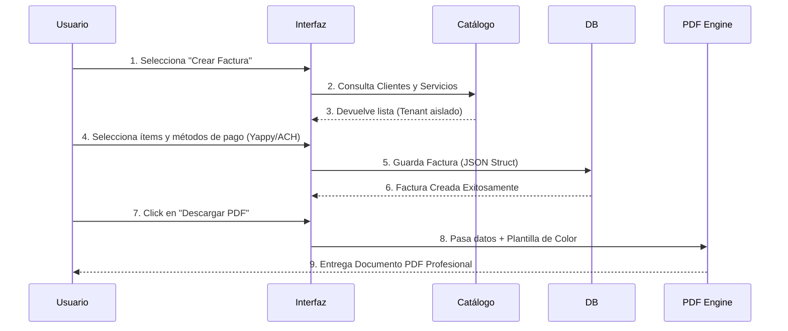

# FacturDV 🚀

FacturDV es una plataforma integral de facturación electrónica diseñada bajo una arquitectura **Multi-Tenant (Múltiples Inquilinos)**. Su propósito principal es permitir a múltiples empresas registrarse, administrar sus catálogos y generar facturas profesionales de forma completamente aislada, segura y eficiente.

---

## 🎯 ¿Qué logra esta aplicación?

FacturDV digitaliza y automatiza el flujo financiero de pequeñas y medianas empresas. Al centralizar la administración, la app logra:

1. **Aislamiento Seguro de Datos:** Gracias a *Row Level Security (RLS)* en PostgreSQL, cada empresa solo tiene acceso a su propia información (clientes, servicios, facturas), previniendo fugas de datos.
2. **Generación Dinámica de PDFs:** Convierte transacciones en documentos PDF altamente profesionales, con plantillas personalizables (Clásica y Moderna) y soporte para colores corporativos y logos.
3. **Gestión de Pagos Estructurada:** Integra nativamente métodos de pago modernos como **Yappy**, **ACH** y **Efectivo**, mostrándolos de manera clara en las facturas generadas.
4. **Inteligencia de Negocio:** Provee reportes financieros exportables a CSV (Top clientes, resúmenes de impuestos ITBMS, ingresos mensuales).
5. **Supervisión Global:** Incluye un panel "Super Admin" para visualizar el desempeño agregado de todas las empresas alojadas en el sistema.

---

## 🏗 Arquitectura del Sistema

El siguiente diagrama muestra el flujo de datos y el modelo Multi-Tenant que garantiza la seguridad y escalabilidad de la aplicación:

---

## 🧩 Diagrama de Flujo de Facturación

¿Cómo funciona la creación de una factura?

---

## 🌟 Características Principales

- **Dashboard Analítico:** Gráficos de ingresos e historial reciente.
- **Módulo de Reportes:** Exportación de reportes de impuestos (ITBMS/IVA) en CSV.
- **Catálogos Reutilizables:** Productos y servicios registrados para evitar recapturar información manual.
- **Configuración de Marca:** Personalización de logo, colores y plantilla de factura (Clásica vs Moderna).
- **Control de Estado:** Seguimiento del ciclo de vida de la factura (Emitida, Pagada, Anulada).
- **Responsive Design:** Interfaz adaptada a dispositivos móviles con modo oscuro nativo.

---

## ⚙️ Stack Tecnológico

- **Frontend:** React 19, Next.js 15 (App Router), TailwindCSS, Radix UI.
- **Backend:** Server Actions (Next.js), Prisma ORM.
- **Base de Datos:** PostgreSQL con soporte de RLS.
- **Generación de Documentos:** `@react-pdf/renderer` para renderizado nativo en servidor.
- **Gestor de Paquetes:** `pnpm`.

---

*Desarrollado con altos estándares de calidad, UI moderna y arquitectura robusta enfocada a la nube.*
