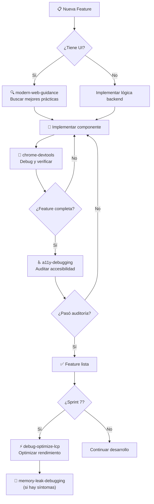

# Skills y Reglas — FacturDV

## 1. Skills Disponibles y Cuándo Usarlas

Se analizaron las **7 skills** instaladas en tu entorno. A continuación, el mapeo de relevancia para FacturDV por fase de desarrollo:

### Matriz de Skills por Fase

| Skill | Sprint 0-1 | Sprint 2-3 | Sprint 4-5 | Sprint 6-7 | Prioridad |
|---|:---:|:---:|:---:|:---:|---|
| **modern-web-guidance** | ✅ | ✅ | ✅ | ✅ | 🔴 Crítica |
| **chrome-devtools** | — | ✅ | ✅ | ✅ | 🟡 Alta |
| **a11y-debugging** | — | — | ✅ | ✅ | 🟡 Alta |
| **debug-optimize-lcp** | — | — | — | ✅ | 🟠 Media |
| **memory-leak-debugging** | — | — | — | ✅ | 🟠 Media |
| **chrome-extensions** | — | — | — | — | ⚪ No aplica |
| **android-cli** | — | — | — | — | ⚪ No aplica |

---

### Detalle por Skill

#### 🔴 `modern-web-guidance` — OBLIGATORIA
**Ruta**: [SKILL.md](file:///home/dany/.gemini/config/plugins/modern-web-guidance-plugin/skills/modern-web-guidance/SKILL.md)

**Cuándo**: SIEMPRE antes de implementar cualquier componente de UI, layout, formulario o interacción de frontend.

**Casos de uso en FacturDV**:
- Crear modales de confirmación (eliminar cliente, cancelar factura)
- Implementar sidebar responsivo y navegación móvil
- Formularios con validación en tiempo real
- Glassmorphism y efectos visuales premium
- Scroll-driven animations en dashboard
- Dialog/Popover para acciones de factura
- Tablas responsivas con scroll horizontal
- Inputs con autofill y estados modernos

**Cómo ejecutarla**:
```bash
# Buscar mejores prácticas antes de implementar
npx -y modern-web-guidance@latest search "responsive sidebar mobile navigation"

# Obtener guía completa
npx -y modern-web-guidance@latest retrieve "dialog-modal-pattern"
```

> [!IMPORTANT]
> Esta skill es **MANDATORIA** para todo componente frontend. Las APIs web evolucionan rápidamente y el conocimiento del modelo puede estar desactualizado.

---

#### 🟡 `chrome-devtools` — DEBUG & TESTING
**Ruta**: [SKILL.md](file:///home/dany/.gemini/config/plugins/chrome-devtools-plugin/skills/chrome-devtools/SKILL.md)

**Cuándo**: Durante desarrollo activo para debugging visual, inspección de red, y automatización de pruebas.

**Casos de uso en FacturDV**:
- Verificar que el PDF se genera correctamente al vuelo
- Inspeccionar llamadas a la API (facturación, autenticación)
- Depurar el flujo de login y redirecciones
- Verificar responsividad en diferentes viewports
- Tomar screenshots para documentación/walkthrough

**Flujo típico**:
```
1. navigate_page → http://localhost:3000
2. take_snapshot → Obtener estructura de la página
3. click/fill → Interactuar con formularios
4. list_network_requests → Verificar API calls
5. take_screenshot → Capturar estado visual
```

---

#### 🟡 `a11y-debugging` — ACCESIBILIDAD
**Ruta**: [SKILL.md](file:///home/dany/.gemini/config/plugins/chrome-devtools-plugin/skills/a11y-debugging/SKILL.md)

**Cuándo**: Después de construir cada vista/página, para validar accesibilidad.

**Casos de uso en FacturDV**:
- Verificar que los formularios tienen labels asociados (clientes, facturas)
- Validar contraste de colores en modo claro/oscuro
- Asegurar navegación por teclado en tablas de facturas
- Touch targets ≥ 48px en botones móviles
- Heading hierarchy correcta (`h1` → `h2` → `h3`)
- Auditar con Lighthouse para score de accesibilidad

**Checklist por página**:
- [ ] Labels en todos los inputs
- [ ] Alt text en imágenes (logos)
- [ ] Focus trap en modales
- [ ] Contraste WCAG AA mínimo
- [ ] Aria-labels en botones de ícono (WhatsApp, PDF, Email)

---

#### 🟠 `debug-optimize-lcp` — PERFORMANCE
**Ruta**: [SKILL.md](file:///home/dany/.gemini/config/plugins/chrome-devtools-plugin/skills/debug-optimize-lcp/SKILL.md)

**Cuándo**: Sprint 7 (QA y Pulido) — optimización de carga del dashboard y páginas principales.

**Casos de uso en FacturDV**:
- Optimizar tiempo de carga del Dashboard (gráficos, stats cards)
- Verificar que el LCP del login sea < 2.5s
- Asegurar que las tablas de facturas no bloqueen el render
- Fetch Priority en logo de empresa

**Objetivos de rendimiento**:
| Métrica | Target | Página |
|---|---|---|
| LCP | < 2.5s | Dashboard, Login |
| INP | < 200ms | Formularios, Tablas |
| CLS | < 0.1 | Todas las páginas |

---

#### 🟠 `memory-leak-debugging` — ESTABILIDAD
**Ruta**: [SKILL.md](file:///home/dany/.gemini/config/plugins/chrome-devtools-plugin/skills/memory-leak-debugging/SKILL.md)

**Cuándo**: Sprint 7 (QA) — si se detectan problemas de memoria, especialmente en:

- Tablas con muchos registros y paginación
- Dashboard con gráficos que se re-renderizan
- Navegación entre empresas (cambio de tenant)

**Flujo de diagnóstico**:
```
1. Navegar por la app realizando acciones repetitivas
2. Tomar memory snapshots (antes, durante, después)
3. Usar memlab para analizar leaks
4. Corregir event listeners y closures
```

---

#### ⚪ `chrome-extensions` y `android-cli` — NO APLICAN
- **chrome-extensions**: FacturDV es una web app, no una extensión de Chrome.
- **android-cli**: La Fase 1 es web. El wrapping con Capacitor/Ionic es Fase 2.

---

## 2. Reglas del Proyecto (ya configuradas)

Se creó el archivo de reglas del proyecto en:

📄 [.gemini/GEMINI.md](file:///home/dany/DV/Code/FacturDV/.gemini/GEMINI.md)

### Resumen de las reglas incluidas:

| Categoría | Reglas Clave |
|---|---|
| **Stack obligatorio** | Next.js 15, TypeScript strict, PostgreSQL 16, Prisma 6, TailwindCSS 4, shadcn/ui |
| **Multi-tenancy** | `company_id` + RLS obligatorio en toda tabla con datos de inquilino |
| **Convenciones TypeScript** | Sin `React.FC`, sin `enum` (usar `as const`), exports nombrados |
| **Nombres de archivos** | `kebab-case.tsx` para componentes, `PascalCase` para clases React |
| **Mobile-First** | Touch targets ≥ 48px, texto ≥ 16px, formularios full-width en móvil |
| **Diseño** | Tema oscuro obligatorio, skeletons para carga, toasts para feedback |
| **Base de datos** | UUIDs, soft delete, `Decimal(10,2)` para montos, transacciones para consecutivos |
| **Facturación** | Sin PDFs almacenados, campos vacíos ocultos, worker idempotente |
| **Seguridad** | bcrypt CF 12, JWT httpOnly, Zod dual, rate limiting, tokens con expiración |
| **Git** | Conventional Commits en español, ramas `feature/<nombre>` |
| **Docker** | 4 servicios, health checks, volúmenes persistentes |

---

## 3. Permisos Recomendados para el Proyecto

El proyecto FacturDV actualmente no tiene permisos configurados. Se recomienda agregar los siguientes para un flujo de desarrollo fluido:

```json
{
  "permissionGrants": {
    "allow": [
      "command(npx)",
      "command(npm run)",
      "command(npm install)",
      "command(docker compose)",
      "command(git init)",
      "command(git add)",
      "command(git commit)",
      "command(git status)",
      "command(git checkout)",
      "command(git branch)",
      "command(git log)",
      "command(find)",
      "command(cat)",
      "command(ls)",
      "command(mkdir)",
      "command(cp)",
      "command(head)",
      "command(tail)",
      "command(wc)",
      "write_file(/home/dany/DV/Code/FacturDV/.env)",
      "write_file(/home/dany/DV/Code/FacturDV/.env.local)"
    ]
  }
}
```

> [!TIP]
> Puedes configurar estos permisos desde la interfaz de Antigravity en **Settings > Projects > FacturDV > Permissions**.

---

## 4. Mejoras Sugeridas para Reglas Globales

Tu archivo [GEMINI.md](file:///home/dany/.gemini/GEMINI.md) global ya es sólido. Sugerencias de mejora:

### Agregar al archivo global (`~/.gemini/GEMINI.md`):

```markdown
## Desarrollo Web
- **Browser Support:** Usar features Baseline Widely Available sin fallback. 
  Features Newly Available solo con feature detection y degradación elegante.
  No implementar polyfills.
- **Formato de Código:** Usar Prettier con configuración por defecto del proyecto.
- **Comentarios en Código:** En español para comentarios de negocio, 
  en inglés para documentación técnica de APIs y tipos.
```

> [!NOTE]
> Estas reglas globales aplican a **todos** tus proyectos. Las reglas específicas de FacturDV en `.gemini/GEMINI.md` del proyecto tienen precedencia.

---

## 5. Flujo de Trabajo Recomendado con Skills


